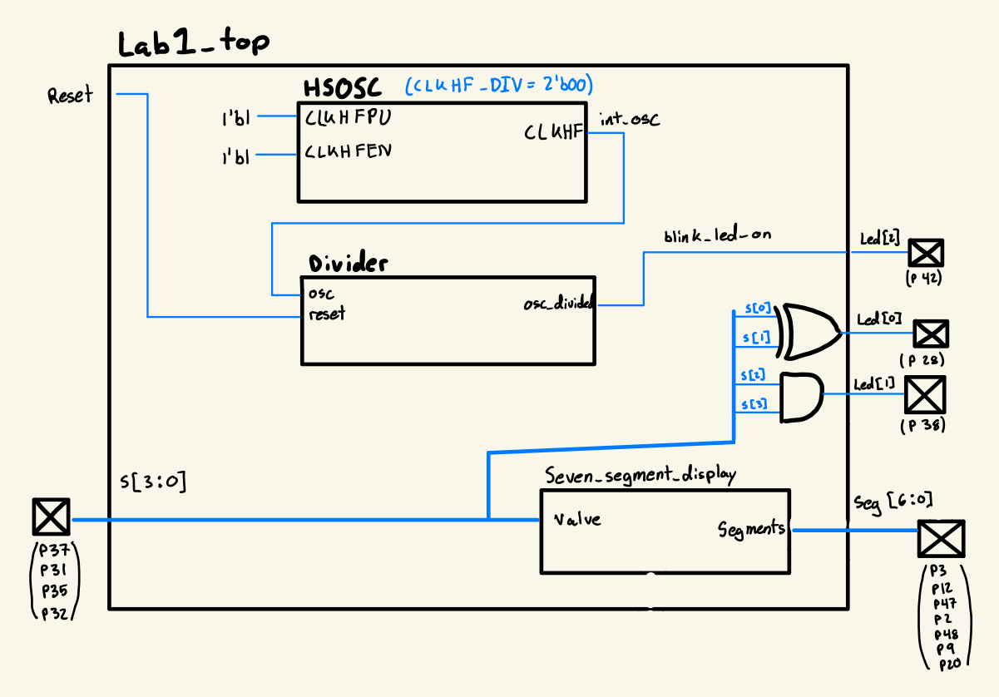
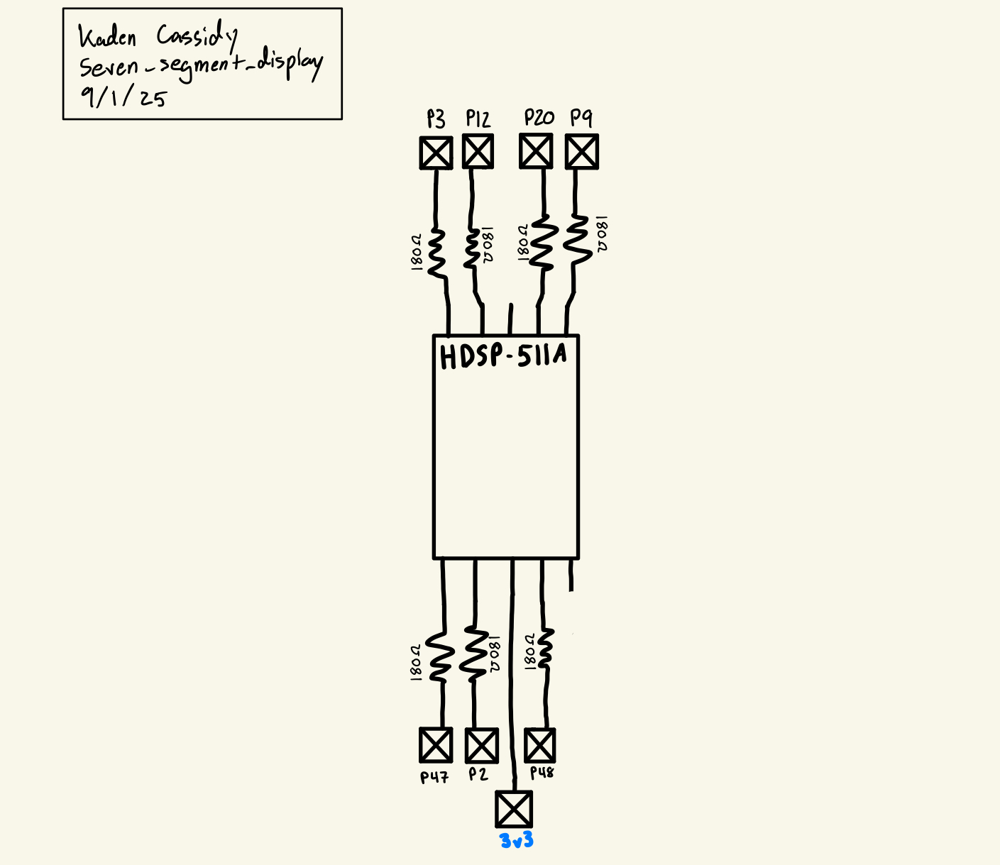
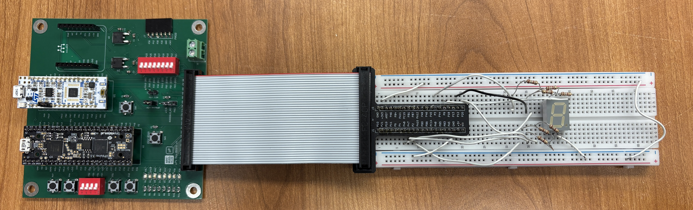
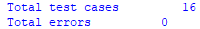
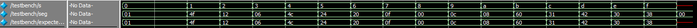

## Introduction

In this lab, simple SystemVerilog modules were designed to control a seven-segment display as well as blink an LED at 2.4Hz. The design utilized onboard switches to designate the hexidecimal number to display as well as the onboard 48MHz high-speed oscillator to generate the 2.4Hz signal.

## Design and Testing Methodology

The on-board high-speed oscillator (HSOSC) from the iCE40 UltraPlus primitive library was used to generate a clock signal at 48 MHz. A register is then used to store the current count, with the clock signal connected to the oscillator and D connected to Q through a 27 bit adder which adds 1 to the current value. A series of AND gates then check when the count has reached 20000000 and toggle a flop. This flop signal is then used to drive the LED since it digitally oscillates at 2.4Hz. 

The seven segment display and onboard LEDs are controlled via combinational logic and their functionality is confirmed by testbenches that consider all 2^4 input permutations. The seven segment display is powered by a 3v3 line where each LED drains through a resistor to a pin on the FPGA.

## Technical Documentation

The source code for the project can be found in the associated [Github repository](https://github.com/jacassidy/E155_Lab1).

## Block Diagram

The block diagram gives a high-level schematic of the overall design. The top module include the high-speed oscillator as well as a divider and the combinational logic used to drive the leds.

## Schematic

The schematic gives the design of the circuit breadboarded, the general idea being that the 3v3 line is connected to a common terminal on the seven segment display, then each LED drains through a 180 ohm resistor to an FPGA pin. If the pin is high, there is no voltage difference and no current flows, when the pin goes low the LED drains through the pin to ground. A resistance of 180 ohms was chosen as 7.5mA was identified as an optimal current from the datasheet, and the LED is expected to have a 1.95v drop at this current. Thus (3.3-1.95) / 7.5mA = 180 ohms.

## Results and Discussion

I was able to successfully complete the entire lab with everything functioning correctly. The system is quick and reliable, and I am very satisfied with the product.

## Testbench Simulation

The testbenches were used to confirm that the LEDs behave properly in all possible permutations of the 4 switches used to control them. Getting the testbench to run also proved useful for debugging before uploading to the FPGA.

## Conclusion

To complete this lab, first the test board had to be soldered in its entirety including many SMD components. A simple test program was then used to debug the programming software and get used to the workflow for using the FPGA in a development environment. SystemVerilog code was then written to generate a 2.4Hz digitally oscillating signal as well as a combinational logic link between 4 onboard switches and an externally wired seven segment display. The seven segment display was then wired on a breadboard to confirm hardware functionality. This lab took me about 10 hours.

## AI Prototype Summary

When giving Chat GPT 5 the following prompt:

>Write SystemVerilog HDL to leverage the internal high speed oscillator in the Lattice UP5K FPGA and blink an LED at 2 Hz. Take full advantage of SystemVerilog syntax, for example, using logic instead of wire and reg.

It responded with [this](https://chatgpt.com/share/68b8a9c3-2b68-8012-8123-0eba9b81e6e8)

When put into a new project it failed because it was using the incorrect library to synthesize the high-speed oscillator module. With some corrections the HDL was able to be run, but the amount of mental effort and analytical thinking it took to diagnose, I preferred to have written the HDL used for my project on my own.

I did not like the result it produced. Firstly it added a lot of bloat to the HDL where completely unnecessary; this included unnecessary long comments and an overall very large top module. I liked some of the ideas it produced, for example using a counter with multiplexers and flip-flops instead of an adder which was a more clever way to create this design. However, it did not put this into a separate module and, since the counter was very large, made it difficult to read and understand.

Overall I would give it a 5 because it created some though provoking questions in terms of how to produce the design, but would not have been useful for creating an initial prototype. This was a rather counter-intuitive experience with AI to what is generally expected.
