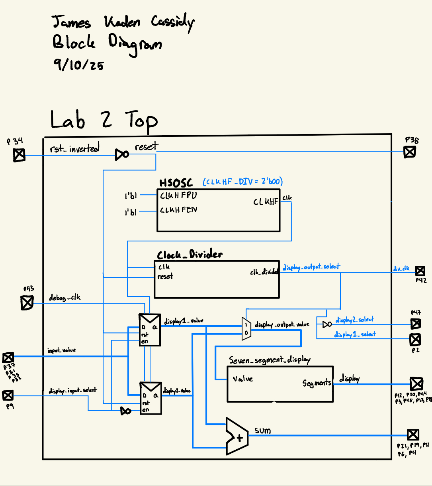
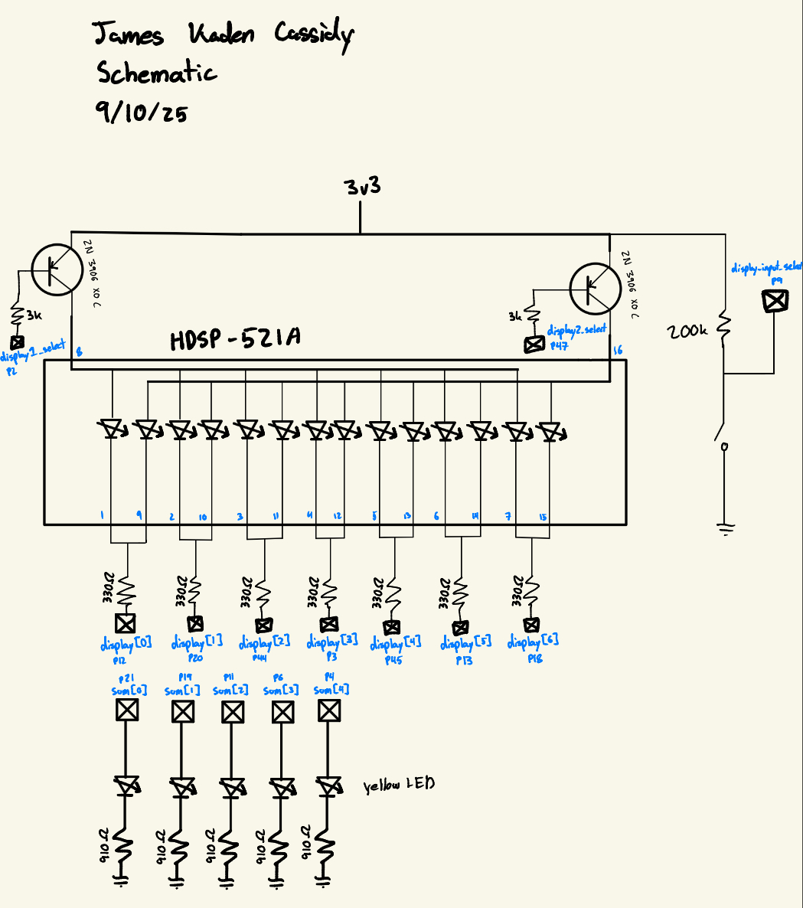
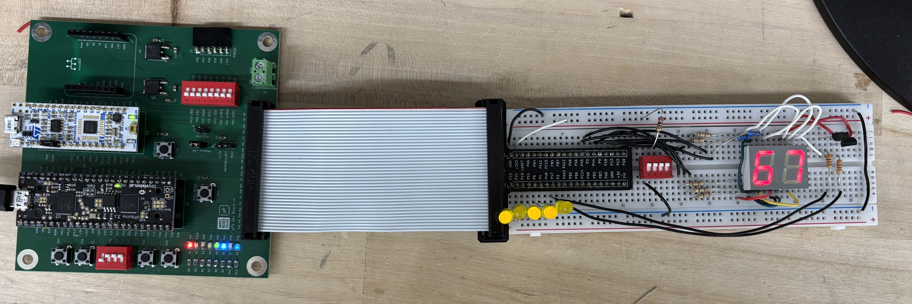
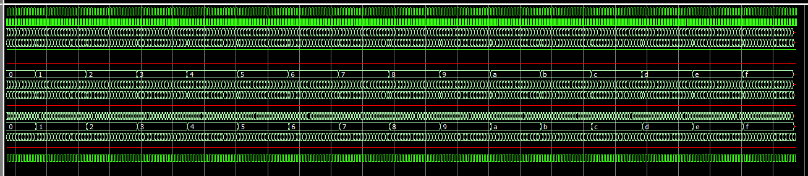
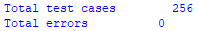
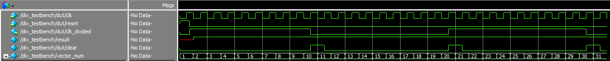
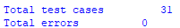
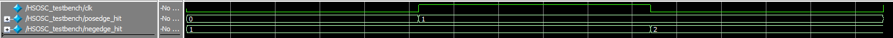
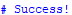

## Introduction

In this lab, the modules from the previous lab were used to control two seven-segment displays with a single display decoder, and a single set of seven pins, by time multiplexing between the two displays. In this lab, the FPGA is used distinctly as a control unit (rather than also as a source of power) to develop a deeper understanding of how to use an FPGA in real world applications.

## Design and Testing Methodology

The on-board high-speed oscillator (HSOSC) from the iCE40 UltraPlus primitive library was used to generate a clock signal at 48 MHz. A register is then used to store the current count, with the clock signal connected to the oscillator and D connected to Q through an adder which adds 1 to the current value. A series of AND gates then check when the count has reached 100000 and toggle a flop. This flop signal is used to designate which value should drive the 7 external pins, and which display to power.

On the breadboard, the common terminals of the two seven-segment displays were bridged so that a single set of 7 pins could be used to drive both displays. A PNP transistor was used to selectively power one display at a time, by connecting an FPGA pin to the base of the transistor through a 3k resistor.

Functionality of the main modules in this lab were confirmed in the previous lab testbenches. In this lab all combinations of the two values were iterated over to confirm that the 5 LED display correctly displayed the two values added together.

## Technical Documentation

The source code for the project can be found in the associated [Github repository](https://github.com/jacassidy/E155_Lab2/tree/main).

## Block Diagram

The block diagram gives a high-level schematic of the overall design. The top module include the high-speed oscillator, divider, flip flops to save the input signal, an adder to calculate the sum and the seven-segment display decoder to drive the displays.

## Schematic

The schematic gives the design of the circuit breadboarded, the general idea is that the two common terminals of the seven-segment displays are connected and then connected through a 330 ohm resistor to an FPGA pin. The power terminal for each display is connected to the collector of a transistor where the base is connected to an FPGA pin through a 3k resistor. The emitter is then connected to the 3v3 line and this setup allows for 9 pins to control 2 seven-segment displays. 

A series of yellow LEDS connected to an FPGA pin and by a 910 ohm resistor to ground are used to display the sum of the two hexidecimal numbers displayed in binary.

## Results and Discussion

I was able to successfully complete the entire lab with everything functioning correctly. The system is quick and reliable, and I am very satisfied with the product.

## Testbench Simulation

The testbenches were used to confirm that the parameterized divider works correctly, the adder correctly sums and displays all possible values and the onboard oscillator oscillates. Getting the testbench to run also proved useful for debugging before uploading to the FPGA.

## Conclusion

To complete this lab, I began by wiring the breadboard carefully as having poor wiring made my previous lab much more difficult to complete. I then wrote the Verilog modules and testbenches to test any I had modified or created. I ended up making several breadboarding mistakes that took time to debug nevertheless. For future labs I will check the circuitry manually before connecting to the FPGA to save time.  This lab took me about 8 hours.

## AI Prototype Summary

When giving Chat GPT 5 the following prompt:

>Create a series of system verilog modules that time multiplex between two seven segment displays using a couple of modules I have already made: seven_segment_decoder(.value, .display) divider #(param div_count) (clk, reset, div_clk) HSOSC(outputs: clk) Inputs to the module can be, reset, display_select, input_value also output a binary sum of the two numbers

It responded with [this](https://chatgpt.com/share/68b8a9c3-2b68-8012-8123-0eba9b81e6e8)

When put into a new project it failed once again because it was using the incorrect library to synthesize the high-speed oscillator module. After some reading through it was able to compile but the module was cluttered with strange syntax, and not very readable in terms of variable names and organization.

One example of a strange choice it made was to include the summing login in an always block instead of an assign. This makes me think its running off a reference of older Verilog code rather than common practice nowadays.

I would give this result a 6.5 out of 10 becuase it does seem to function but I do not like the formatting so if I would then have to modify the Verilog for further functionality, I would have rather written it myself than using its reference.
