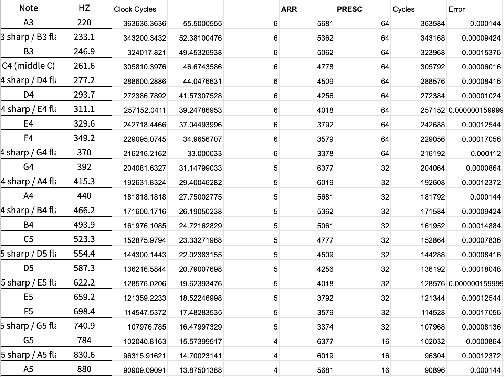
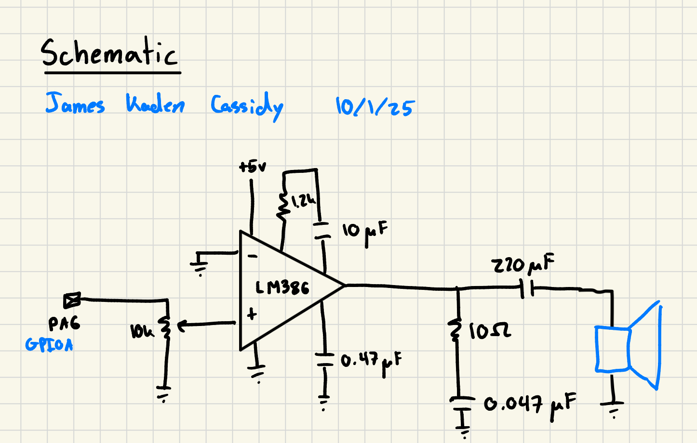

## Introduction

In this lab, the datasheet and reference manual for the STM32L432KC were used to create function to drive GPIO output at a desired PWM frequency and duty cycle for specified lengths of time. This allowed a speaker to be driven to the tune of a melody

## Design

This lab required a lot of reading and deep understanding of microarchitecture to setup the GPIO and timer functionality since open source libraries were not allowed. Searching through the datasheet for all requirements to enable these peripherals gave a lot of perspective of both what the processor is capable of and how to best navigate these large documents.

ARR and PSC values for the timers were chosen to be fixed for "wait" delays as 0.01ms of precession was adequate, but a dynamic algorithm was used for PWM frequency to achieve target accuracy of 1% as confirmed in the table below:

## Technical Documentation

The source code for the project can be found in the associated [Github repository](https://github.com/jacassidy/E155_Lab4).

## Schematic

The schematic gives the design of the circuit breadboarded, an op-amp is used to boost the signal so that it can drive a speaker; a potentiometer is used to adjust volume.

## Results and Discussion

I was able to successfully complete the entire lab with everything functioning correctly. 

## Conclusion

As briefly stated before this lab gave a lot of perspective of what is in the technical documents associated with a processor and how best to navigate them. Starting from high level diagrams and identifying signals desired proved incredibly useful for then narrowing down and deciding which registers to assign values to to enable peripherals. This lab excites me for what these processors are capable of doing and I hope I can push the limits of the hardware effectively in the future.

This lab took me 10 hours.

## AI Prototype Summary

In this lab I analyzed giving Chat GPT 5 the reference manual and datasheet and asked it what it would take to create PWM on the GPIO

[Link to transcript](https://chatgpt.com/share/68dd1067-184c-8012-81c9-e67a6dd59985)

As a document search assistant, it worked well: it pulled timer features, AF pin tables, and register maps from the datasheet and programming manual quickly. Compared to HDL generation tasks in earlier prototypes, it was arguably more useful here—because the STM32 manuals are dense and Ctrl-F isn’t always enough. For Verilog generation it’s hit-or-miss, but for navigating big ST manuals it’s a strong accelerant.