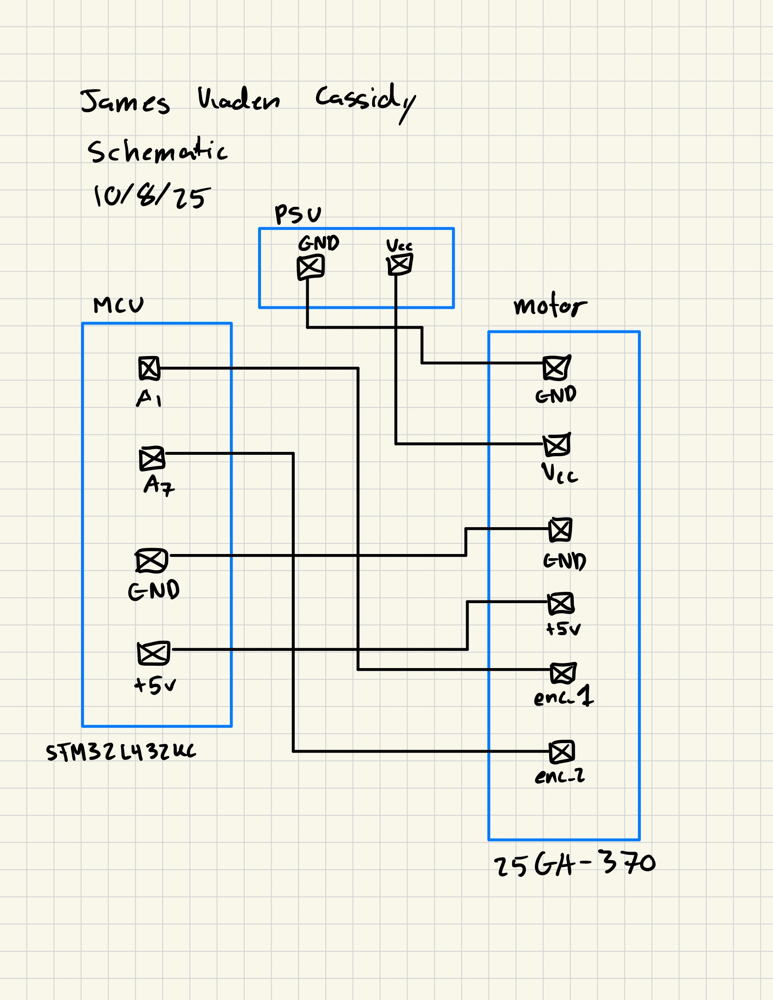

## Introduction

In this lab, interrupts are used to monitor a motor encoder to determine the rps with direction and handling edge cases.

## Design

This lab required reading through the reference manual, programming manual and data sheet to debug interrupt code and successfully get two interupts working in parallel and interacting with one another.

## Technical Documentation

The source code for the project can be found in the associated [Github repository](https://github.com/jacassidy/E155_Lab5).

## Schematic

The schematic gives the design of the circuit breadboarded, essentiall the motor is just connected to power and to the MCU.

## Results and Discussion

I was able to successfully complete the entire lab with everything functioning correctly. 

## Conclusion

This lab taught the general basics of what interrupts look like internally on the MCU and what the range of functionality is regarding interrupts. It also taught good habits for management of interrupts and how to integrate them to a synchronous loop.

This lab took me 10 hours.

## AI Prototype Summary

In this lab I analyzed giving Chat GPT 5 an open-ended prompt to create interupt based motor encoder monitor for the STM32l432KC

[Link to transcript](https://chatgpt.com/share/68e6bf5d-43a8-8012-9630-d2eb54f23e2b)

Although the lab restricted us from using timer-based interrupts, the LLM’s generated solution—which leveraged the STM32L432KC’s hardware encoder mode on TIM2 (PA0/PA1)—seeming like a better solution than the required EXTI interrupt approach. It did not immediately compile but I liked the ideas behind it and would say in this case, the LLM was very helpful as a starting base for doing the most conventional and effective approach.