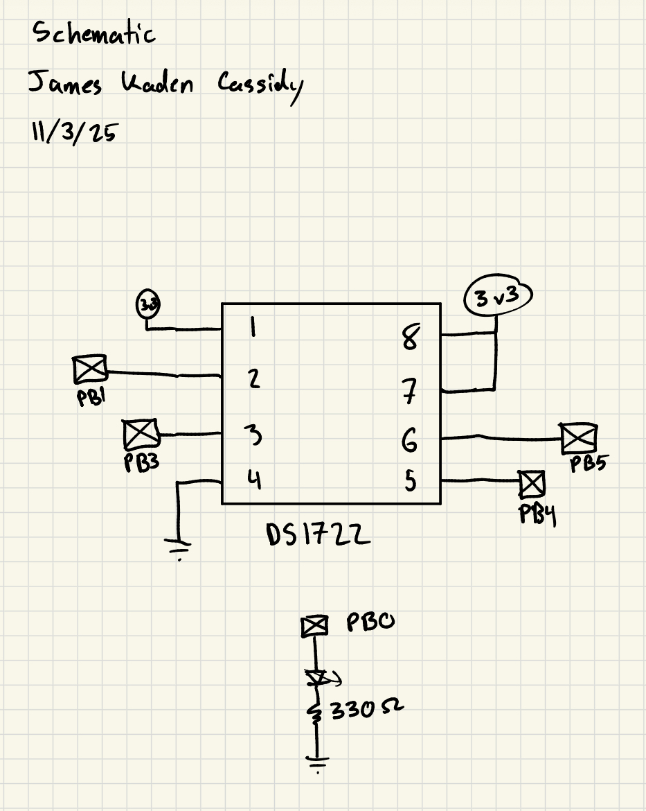
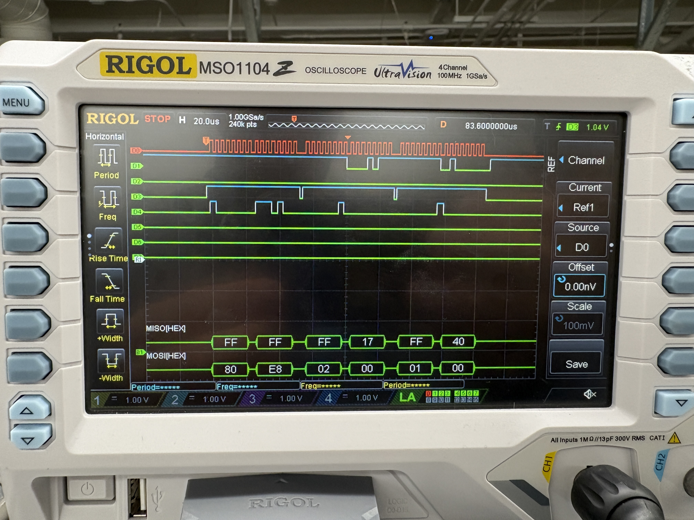

## Introduction

In this lab, the internal SPI and USART peripheral handlers are used to communicate with other microcontrollers to display a webpage with the current room temperature and toggle an onboard LED.

## Design

This lab required reading through the reference manual and data sheet for the temperature sensor in order to get SPI functioning and properly read and write data to and from the temperature sensor.

## Technical Documentation

The source code for the project can be found in the associated [Github repository](https://github.com/jacassidy/E155_Lab6).

## Schematic

The schematic gives the design of the circuit breadboarded, it simply describes the SPI connection to the temperature sensor and the gpio pin connected to the external LED.

## Results and Discussion

Above is a sample SPI transaction measured on the oscilloscope logic analyzer.

I was able to successfully complete the entire lab with everything functioning correctly. 

## Conclusion

This lab taught how t enable and properly designate tasks to the built in SPI unit on the microcontoller so that the loop didn't need to be stalled by this communication

This lab took me 12 hours.

## AI Prototype Summary

For this lab I gave chat GPT-5 two simple prompts to generate the HTML and c code for this lab, results included below:

[Link to transcript](https://chatgpt.com/share/69092b99-bc48-8012-9438-ee04a5abd60e)

Overall it did a pretty good job of identifying the correct registers to modify and best practices for organizing the code to achieve the desired features. It did not work on the first try and from debugging my own implementation I can tell its because it must have incorrectly accessed these registers, either missing some requirements or doing so in the wrong order. Overall it would be a helpful starting point but it could be more costly in time in the end.